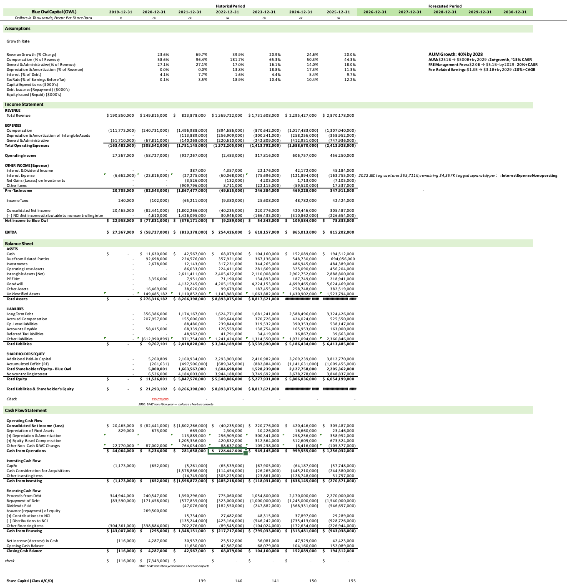

# Blue Owl Capital 3-Statement-Model
### Full 3-statement financial model for Blue Owl Capital (NYSE: OWL), built from live SEC EDGAR data using Power Query and Excel.

This project extracts live SEC filing data via the XBRL API, transforms it with Power Query, and builds a linked Income Statement, Balance Sheet, and Cash Flow Statement, reconciled to the 10-K.
	

### Key Components:
- **Automated Data Pipeline** : Power Query pulls financials directly from SEC EDGAR's JSON API (CIK 0001823945), eliminating manual data entry
- **Historical Analysis (2019–2025)** : 7 years of audited 10-K data with GAAP-tagged line items
- **Forecasting Framework** : assumption-driven projections through 2030, informed by 2026 Q1 investor deck guidance on revenue growth, compensation ratios, and tax rates
- **Credit & Profitability Ratios** : leverage, coverage, liquidity, and per-share metrics
- **Balance Sheet Check** : automatic validation that Assets = Liabilities + Equity
- **Cash Flow Reconciliation** : links net income to operating cash flow with non-cash adjustments

### Tools:
- Excel
- Power Query (M language)
- SEC EDGAR XBRL API

## Data Source
Raw data pulled via SEC EDGAR's XBRL Company Facts API (JSON):
[`CIK0001823945.json`](https://data.sec.gov/api/xbrl/companyfacts/CIK0001823945.json)

> [!NOTE]
> This endpoint returns all GAAP-tagged financial facts Blue Owl has reported across its filing history, which are then filtered and transformed via Power Query into the model's Income Statement, Balance Sheet, and Cash Flow Statement.

Source: [View Blue Owl's latest 10-K on SEC EDGAR](https://www.sec.gov/cgi-bin/browse-edgar?action=getcompany&CIK=0001823945&type=10-K)

#### Skills:
- Financial statement analysis
- Data extraction & transformation
- Formula-based modeling
- Assumption-driven forecasting
- Ratio analysis

> [!NOTE]
> *For demonstration purposes only. Prepared independently by Kristen Gallagher.*

## License

© 2025 Kristen Gallagher. All rights reserved. This work is made available for viewing and reference purposes only. Reproduction, distribution, modification, or use of this work without explicit written permission from the author is strictly prohibited. Any reference to this work must include appropriate credit to the author.

